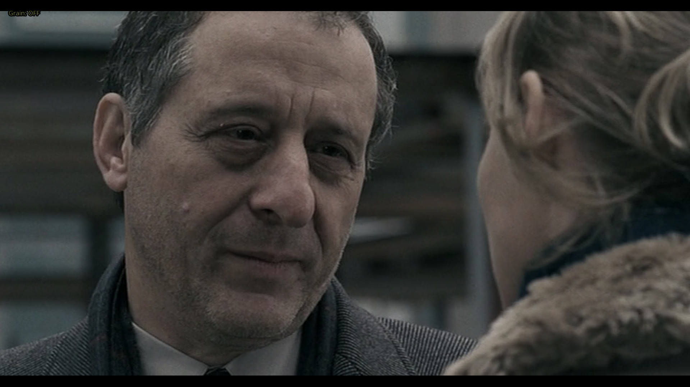
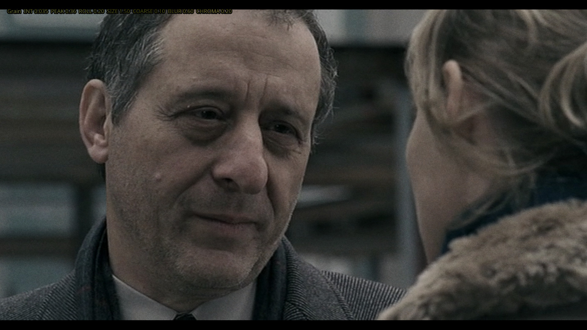
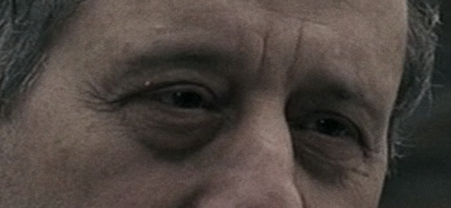
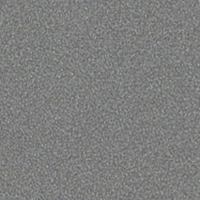
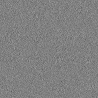
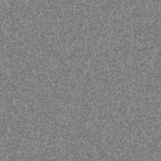
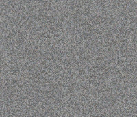
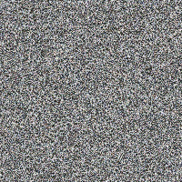
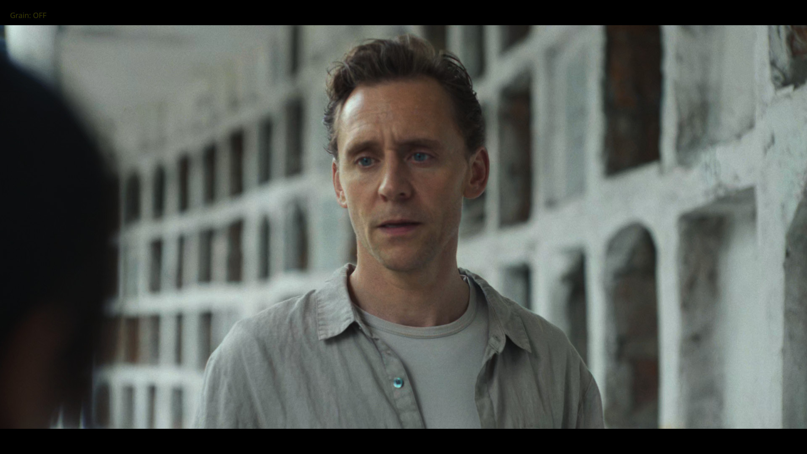
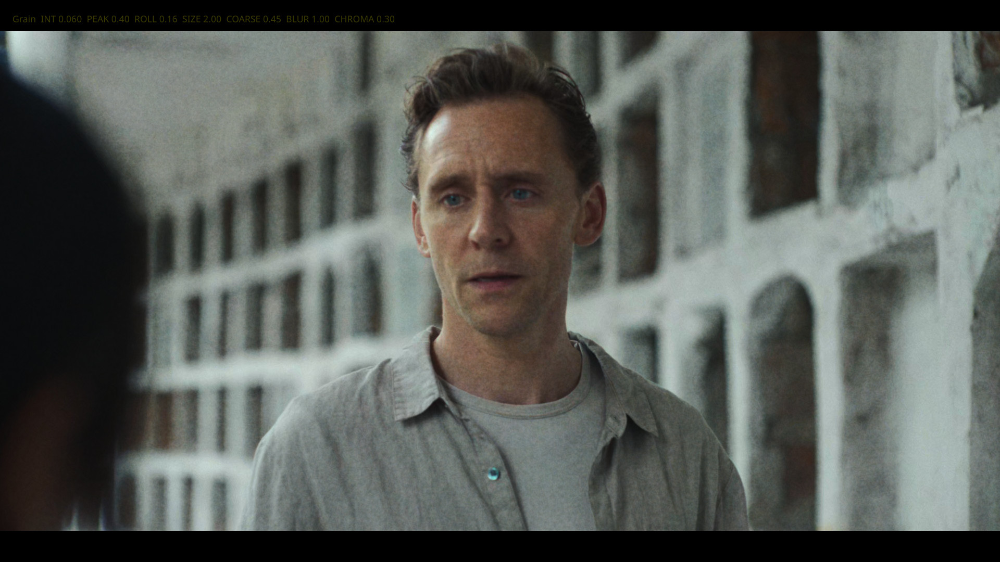

# cinegrain

A film grain shader for [mpv](https://mpv.io) with real-time parameter control.

Being frustrated with titles like the 4k release of Aliens, which are de-noised to death and look terrible, I looked for a way to make them watchable again by adding the missing grain back to them. 

The most widely used mpv grain shader is perhaps haasn's [filmgrain-smooth](https://github.com/haasn/gentoo-conf/blob/xor/home/nand/.mpv/shaders/filmgrain-smooth.glsl) (LGPL v2.1+). It generates good random noise, but has some drawbacks compared to real film grain:

**1. Gray lift in shadows**
Adding any positive-leaning grain to near-black pixels raises them above zero. Blacks become gray. Crushing shadow detail.

**2. Over-grain in highlights**
On bright areas, small absolute offsets are much more visible than in midtones. The grain looks harsh and video-like exactly where it should disappear.

**3. Digital pixel noise**
The original shader generates one independent random value per pixel. Real film grain consists of silver halide crystals that span multiple pixels and cluster organically — the result is spatially correlated, not per-pixel static.

**4. No size control, no color**
One pixel, one value, one channel. Film grain has texture, scale, and subtle color variation.

---

## Solution

### Luminance Bell Curve

Grain intensity is modulated by a Gaussian bell curve over luminance:

```
weight = exp(-0.5 * ((luma - PEAK) / ROLLOFF)²)
```

- Shadows → weight → 0 → blacks stay black
- Highlights → weight falls → no harsh grain on bright areas
- Midtones → peak grain, like real film

### Multi-Scale Value Noise

Instead of per-pixel randomness, grain is generated as **value noise**: random values on a coarser grid, smoothly interpolated between grid points using a **quintic smoothstep** (C² continuous — no visible grid edges).

Two layers run simultaneously:
- **Fine layer** at `GRAIN_SIZE` pixels
- **Coarse layer** at `GRAIN_SIZE × 2.5` pixels

Mixed by `COARSE_MIX`. This reproduces the multi-scale texture of real film grain where fine silver crystals cluster into larger structures.

### Spatial Correlation via Blur

A 5-tap cross-pattern blur further softens hard grid edges:

```glsl
n0*2 + n(+r,0) + n(-r,0) + n(0,+r) + n(0,-r)  /  6
```

The blur radius scales with `GRAIN_SIZE` and is controlled by `BLUR`.

### Color Grain

Real film has subtle color variation in the grain — warm/cool shifts in the R and B channels, independent of luma. We add separate R and B noise at 1.8× the grain scale (chroma grain is coarser on film), scaled by `CHROMA`.

### Live Parameter Control

The shader uses mpv's `//!PARAM` directive to declare all parameters as GLSL uniforms. A companion Lua script sets them at runtime via `glsl-shader-opts` — no shader recompile, no file writes, instant feedback.

---

## Parameters

| Parameter | Default | Range | Description |
|-----------|---------|-------|-------------|
| `INTENSITY` | 0.040 | 0–2 | Overall grain strength |
| `PEAK` | 0.40 | 0–1 | Luminance where grain peaks (0=shadows, 1=highlights) |
| `ROLLOFF` | 0.20 | 0.01–2 | Bell curve width (larger = grain over wider tonal range) |
| `GRAIN_SIZE` | 2.0 | 0.5–6 | Primary grain size in pixels |
| `COARSE_MIX` | 0.30 | 0–1 | Coarse layer amount (0 = fine only, 1 = coarse only) |
| `BLUR` | 0.40 | 0–1 | Grain softness (0 = crisp, 1 = soft) |
| `CHROMA` | 0.30 | 0–1 | Color grain strength (R/B channel shifts) |

---

## Key Bindings

The companion `grain-control.lua` script provides live keyboard control (QWERTZ layout):

| Keys | Parameter |
|------|-----------|
| `ALT+q` | Toggle grain on/off |
| `ALT+,` / `ALT+.` | Cycle presets (prev/next) |
| `ALT+r` / `ALT+f` | INTENSITY +/- |
| `ALT+t` / `ALT+g` | PEAK +/- |
| `ALT+z` / `ALT+h` | ROLLOFF +/- |
| `ALT+u` / `ALT+j` | GRAIN_SIZE +/- |
| `ALT+i` / `ALT+k` | COARSE_MIX +/- |
| `ALT+o` / `ALT+l` | BLUR +/- |
| `ALT+p` / `ALT+ö` | CHROMA +/- |

The OSD displays all current parameter values persistently. When a preset is active, its name is shown in brackets (e.g. `[35mm high]`). Manually adjusting any parameter after loading a preset switches the display to `[custom]`.

---

## Installation

1. Copy `cinegrain.glsl` to `~/.config/mpv/shaders/`
2. Copy `grain-control.lua` to `~/.config/mpv/scripts/`
3. Add to `mpv.conf`:

```ini
glsl-shaders-append="~~/shaders/cinegrain.glsl"
```

The Lua script loads automatically from the scripts directory.

---

## Presets

All presets are defined at the top of `grain-control.lua` and can be edited freely. Cycle through them with `ALT+,` / `ALT+.`.

### Aliens (1986) 4K Blu-ray
The 4K transfer of Aliens is de-noised to death. The **35mm high** preset matches the grain texture of the 1080p version missing in the 4K transfer.

```
INTENSITY  0.050
PEAK       0.40
ROLLOFF    0.30
GRAIN_SIZE 1.25
COARSE_MIX 0.70
BLUR       0.80
CHROMA     0.20
```

### 35mm Normal
Scanned 35mm grain — moderate intensity, high COARSE_MIX for organic clustering, low BLUR for crispness.

```
INTENSITY  0.075   PEAK  0.40   ROLLOFF  0.40
GRAIN_SIZE 1.25    COARSE_MIX  0.60   BLUR  0.10   CHROMA  0.20
```

### 35mm high
Softer, more pronounced grain with higher blur — good for de-noised transfers where grain needs to read as film texture rather than noise. Works well for Aliens 4K and similar over-processed masters.

```
INTENSITY  0.050   PEAK  0.40   ROLLOFF  0.30
GRAIN_SIZE 1.25    COARSE_MIX  0.70   BLUR  0.80   CHROMA  0.20
```

---

## Side Effects (the good kind)

Grain does something unexpected beyond texture: it **masks compression artifacts and makes the image appear sharper**.

This is a dithering effect. Compression artifacts and upscaling softness both create false smooth gradients. Adding spatially-correlated noise breaks up those gradients, returning apparent detail. The effect is particularly strong on:

- Low-bitrate sources (streaming, old DVDs, 720p encodes)
- Over-smoothed 4K remasters of older films
- Any source where aggressive noise reduction has removed real texture

The toggle (`ALT+q`) makes this immediately visible. Switch grain on — the image snaps into focus, banding disappears, fine detail returns. The grain is not adding sharpness; it is revealing it. On the other hand it allows you to apply more sharpening without visually oversharpening it, since the sharpening-artifacts are masked.

---

## Before / After

Source: 720p DVD — low-bitrate encode with visible compression noise.

**Without grain**


**With grain**


Detail:

| Without grain | With grain |
|:---:|:---:|
|  |  |

It is a a little hard to see at this size, but compression artifacts are masked and the image reads as sharper and more filmic despite being the same low-resolution source.

---

## Presets

The following presets were developed by comparing against real 35mm grain scans. Appears a little blurry due to high magnification — actual grain is finer ab sharper at normal viewing distance. Playing with the parameters can simulate quiet a variety of actual film grain.

| Reference scan 1 | Reference scan 2 |
|:---:|:---:|
|  |  |

Tuned to match the character of specific film stocks. Use as starting points.

### 35mm G3
Fine-grain stock. Subtle texture, almost invisible — good for modern films or sources you want to enhance without it being obvious.

```
INTENSITY  0.125   PEAK  0.35   ROLLOFF  0.40
GRAIN_SIZE 1.0     COARSE_MIX  0.0   BLUR  0.0   CHROMA  0.30
```


### 35mm (pushed)
Coarser, more character. Older stock feel.

```
INTENSITY  0.190   PEAK  0.35   ROLLOFF  0.47
GRAIN_SIZE 0.75    COARSE_MIX  0.40   BLUR  0.0   CHROMA  0.20
```


### Kodak Gold 200
Consumer film stock. Chunky, warm grain with visible color separation. Strong effect.

```
INTENSITY  0.500   PEAK  0.29   ROLLOFF  0.45
GRAIN_SIZE 0.5     COARSE_MIX  0.20   BLUR  0.0   CHROMA  0.30
```


---

## Visual Comparison

Same frame, four different settings. Shows what **GRAIN_SIZE** and **COARSE_MIX** actually do.

*Best viewed when opened in a new tab.*

**No grain**


**Fine / mosquito** — `SIZE 0.50  COARSE 0.55  INT 0.125`


**Medium / cinematic** — `SIZE 2.00  COARSE 0.20  INT 0.055`


**Large / coarse** — `SIZE 2.00  COARSE 0.45  INT 0.060`


**Fine + high COARSE_MIX** (top right): sub-pixel grain clusters into irregular blobs — looks like video noise or mosquito artifacts, not film.

**Medium SIZE + low COARSE_MIX** (bottom left): smooth, fine texture. Looks like a clean fine-grain stock. Good baseline for most sources.

**Medium SIZE + high COARSE_MIX** (bottom right): the same grid but with coarser clumping structure layered on top. This is what pushed or older 35mm film looks like — irregular clusters with visible scale variation.

The key takeaway: **GRAIN_SIZE sets the base scale, COARSE_MIX sets how organic it looks**. Fine grain with high COARSE_MIX reads as noise. Coarser grain with moderate COARSE_MIX reads as film.

---

## Tuning Guide

**Start with INTENSITY.** Toggle the shader on/off (`ALT+z`) to compare. Aim for the difference to be felt rather than seen.

**GRAIN_SIZE** controls the visual scale of the grain. Match the source: older film tends to be coarser (2.5–4), modern film finer (1.5–2).

**COARSE_MIX** adds the "clumping" character of real film. Low values look more like fine-grain stocks (Kodak 5203), higher values like pushed or older stocks.

**ROLLOFF** widens or narrows the tonal range where grain appears. Low values (0.15–0.25) concentrate grain in midtones only — good for clean digital sources. Higher values give a more analog character across the full range.

**CHROMA** adds subtle color variation. Keep it below INTENSITY. Values above 0.5 start looking like digital camera noise.

**BLUR** is usually set once per screen size. Larger displays or projectors benefit from more blur (0.4–0.6) to avoid seeing the noise grid at large grain sizes.

---

## License

MIT — see [LICENSE](LICENSE).

The PRNG (permutation hash) used in this shader is derived from Niklas Haas's work in [libplacebo](https://github.com/haasn/libplacebo) (LGPL v2.1+). The original permutation hash and Gaussian approximation are his; the luminance weighting, multi-scale noise, spatial blur, and colour grain are original additions.
