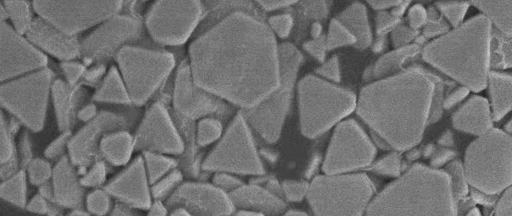
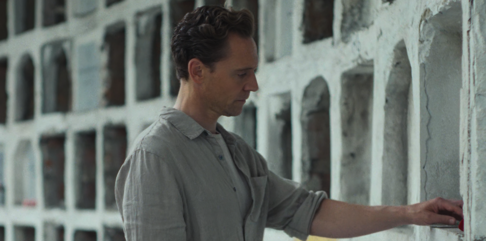
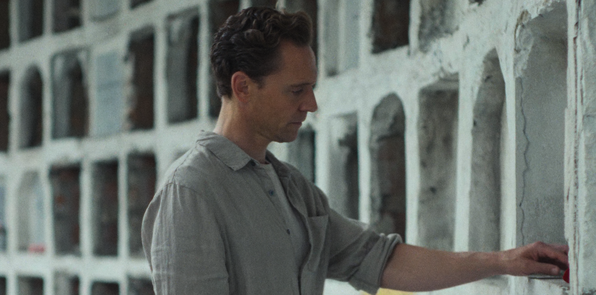
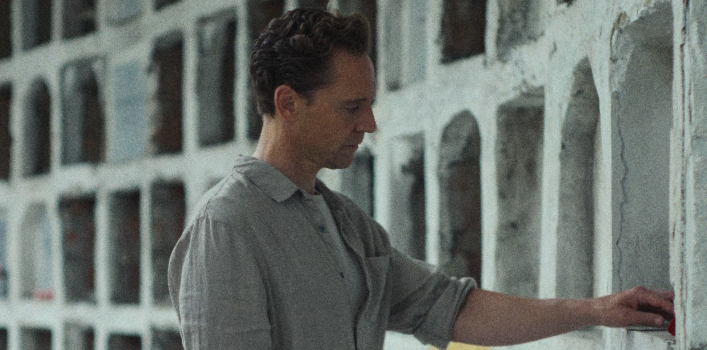
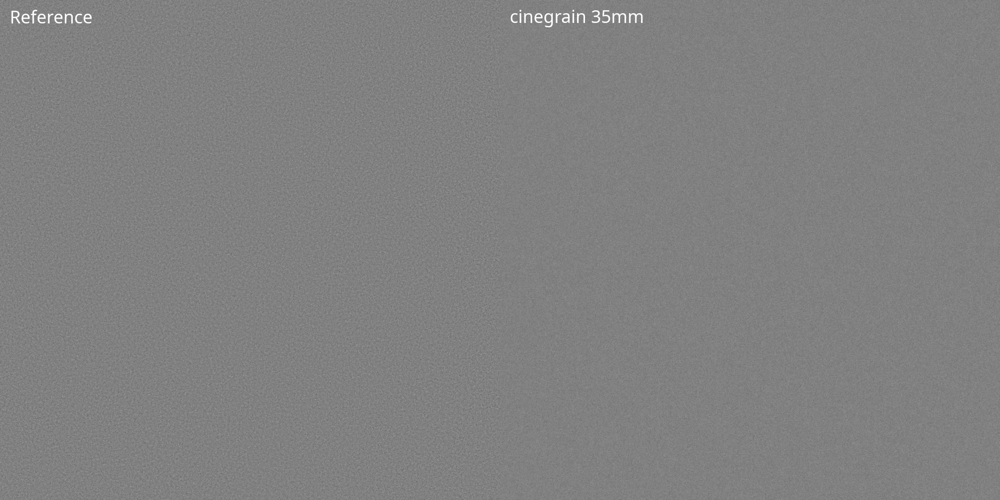
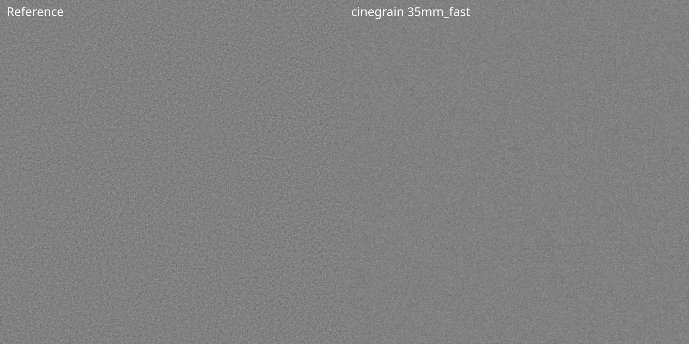
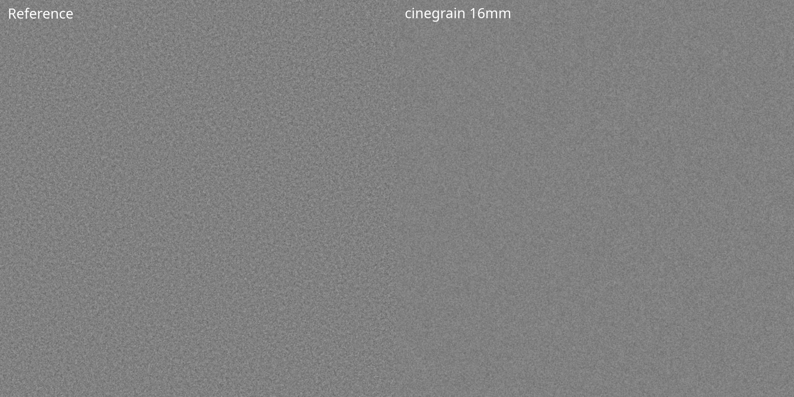
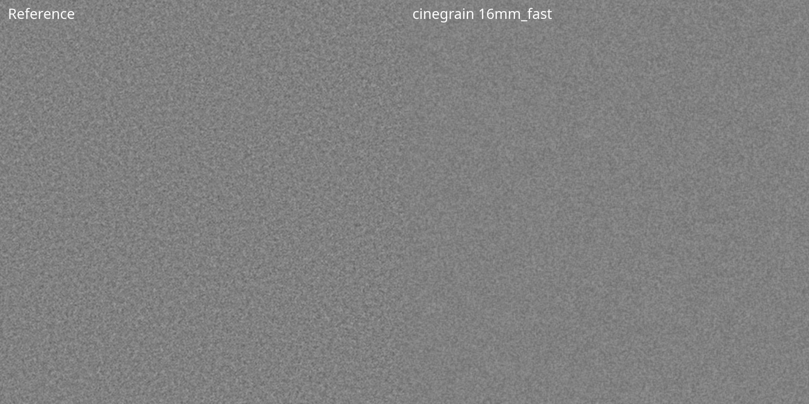
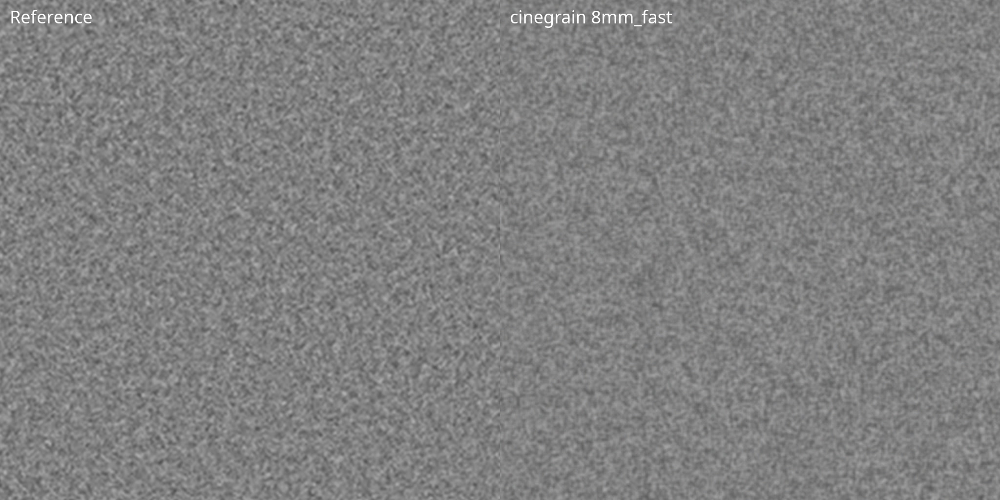

# cinegrain - Let's make some noise!

<p align="left"></p>

cinegrain is a glsl film grain shader for [mpv](https://mpv.io) with real-time parameter control.

Being frustrated with titles like the 4k release of Aliens, which are de-noised to death and look terrible, I looked for a way to make them watchable again by adding back the missing grain.

The most widely used mpv grain shader is perhaps haasn's [filmgrain-smooth](https://github.com/haasn/gentoo-conf/blob/xor/home/nand/.mpv/shaders/filmgrain-smooth.glsl) (LGPL v2.1+). It generates good random noise, but has some drawbacks compared to real film grain:

**1. Gray lift in shadows**
Adding any positive-leaning grain to near-black pixels raises them above zero. Blacks become gray. Crushing shadow detail.

**2. Over-grain in highlights**
On bright areas, small absolute offsets are much more visible than in midtones. The grain looks harsh and video-like exactly where it should disappear.

**3. Digital pixel noise**
The original shader generates one independent random value per pixel. Real film grain consists of silver halide crystals that span multiple pixels and cluster organically — the result is spatially correlated, not per-pixel static.

**4. No size control, no color**
One pixel, one value, one channel. Film grain has texture, scale, and subtle color variation.

---

## Solution

### Luminance Curve

Grain intensity follows an asymmetric curve over luminance — a Gaussian bell for highlight rolloff combined with a square-root ramp in the shadows:

```
bell   = exp(-0.5 * ((luma - PEAK) / ROLLOFF)²)
shadow = sqrt(luma / PEAK)
weight = bell × shadow
```

The shadow side follows the **Selwyn granularity law**: grain RMS is proportional to the square root of exposure. This matches measured film data (cf. AV1 film grain synthesis paper, Fig. 5) and produces a steeper, more natural shadow fade than a symmetric bell curve.

- Shadows → sqrt ramp → 0 at black, steep rise → no gray lift
- Highlights → Gaussian rolloff → no harsh grain on bright areas
- Midtones → peak grain at `PEAK`, like real film

### Multi-Scale Value Noise

Instead of per-pixel randomness, grain is generated as **value noise**: random values on a coarser grid, smoothly interpolated between grid points using a **quintic smoothstep** (C² continuous — no visible grid edges).

Two layers run simultaneously:
- **Fine layer** at `GRAIN_SIZE` pixels
- **Coarse layer** at `GRAIN_SIZE × 1.5` pixels

Mixed by `COARSE_MIX`. This reproduces the multi-scale texture of real film grain where fine silver crystals cluster into larger structures.

### Spatial Correlation via Blur

A 5-tap cross-pattern blur further softens hard grid edges in the coarse layer:

```glsl
n0*2 + n(+r,0) + n(-r,0) + n(0,+r) + n(0,-r)  /  6
```

The blur radius scales with `GRAIN_SIZE` and is controlled by `BLUR`.

### Softness (Post-Blur)

An optional 9-tap spatial blur over the final grain signal, controlled by `SOFTNESS`. The blur radius is **relative to grain size** (`r = SOFTNESS × GRAIN_SIZE`), so the same SOFTNESS value produces proportionally correct blur at any grain scale — from sub-pixel 35mm to coarse 8mm.

This reproduces the optical softening that occurs when small film grain is magnified to projection size: 8mm grain projected onto a cinema screen is inherently softer than 35mm grain at the same screen size.

### Color Grain

Real film has subtle color variation in the grain — warm/cool shifts in the R and B channels, independent of luma. We add separate R and B noise at 1.8× the grain scale (chroma grain is coarser on film), scaled by `CHROMA`.

### Live Parameter Control

The shader uses mpv's `//!PARAM` directive to declare all parameters as GLSL uniforms. A companion Lua script sets them at runtime via `glsl-shader-opts` — no shader recompile, no file writes, instant feedback.

---

## Parameters

| Parameter | Range | Description |
|-----------|-------|-------------|
| `INTENSITY` | 0–2 | Overall grain strength |
| `PEAK` | 0–1 | Luminance where grain peaks (0=shadows, 1=highlights) |
| `ROLLOFF` | 0.01–2 | Bell curve width (larger = grain over wider tonal range) |
| `GRAIN_SIZE` | 0.5–6 | Primary grain size in pixels |
| `COARSE_MIX` | 0–1 | Coarse layer amount (0 = fine only, 1 = coarse only) |
| `BLUR` | 0–1 | Grain texture (0 = smooth organic blobs, 1 = fine pixel noise) |
| `CHROMA` | 0–1 | Color grain strength (R/B channel shifts) |
| `SOFTNESS` | 0–8 | Spatial blur over grain (relative: actual radius = SOFTNESS × GRAIN_SIZE) |

---

## Key Bindings

The companion `grain-control.lua` script provides live keyboard control (QWERTZ layout):

| Keys | Parameter |
|------|-----------|
| `ALT+q` | Toggle grain on/off |
| `ALT+,` / `ALT+.` | Cycle presets (prev/next) |
| `ALT+r` / `ALT+f` | INTENSITY +/- |
| `ALT+t` / `ALT+g` | PEAK +/- |
| `ALT+z` / `ALT+h` | ROLLOFF +/- |
| `ALT+u` / `ALT+j` | GRAIN_SIZE +/- |
| `ALT+i` / `ALT+k` | COARSE_MIX +/- |
| `ALT+o` / `ALT+l` | BLUR +/- |
| `ALT+p` / `ALT+ö` | CHROMA +/- |

The OSD displays all current parameter values persistently. When a preset is active, its name is shown in brackets (e.g. `[35mm high]`). Manually adjusting any parameter after loading a preset switches the display to `[custom]`.

---

## Installation

1. Copy `shader/cinegrain.glsl` to `~/.config/mpv/shaders/`
2. Copy `shader/grain-control.lua` to `~/.config/mpv/scripts/`
3. Add to `mpv.conf`:

```ini
glsl-shaders-append="~~/shaders/cinegrain.glsl"
```

The Lua script loads automatically from the scripts directory.

---

## Presets

All presets are defined at the top of `grain-control.lua` and can be edited freely. Cycle through them with `ALT+,` / `ALT+.`.

### Calibration methodology

The built-in presets simulate real film grain for 35mm, 16mm, and 8mm film formats with different speeds. Each was calibrated by visual A/B comparison against lossless PNG screenshots of actual film grain scans (projected at DCI 4K resolution onto a 50% gray card, with all processing disabled).

The key insight: **all film formats share the same emulsion** — the only physical difference is the gate size (how much of the negative is exposed) and the film speed (ISO). Larger formats show finer grain because the image is magnified less; faster film stocks have physically larger silver halide crystals.

This means the grain *character* — its organic shape, spatial correlation, and blur — is identical across formats. Only three parameters change:

| Parameter | What it represents |
|---|---|
| `GRAIN_SIZE` | Gate size × film speed (magnification + crystal size) |
| `INTENSITY` | Perceived grain strength at projection size |
| `SOFTNESS` | Spatial blur (relative to grain size) |

All other parameters are universal:

```
BLUR       0.55    -- texture mix (value noise vs pixel hash)
COARSE_MIX 0.70    -- dual-scale clustering ratio
CHROMA     0.05    -- subtle color variation
PEAK       0.40    -- grain peaks in midtones
ROLLOFF    0.40    -- bell curve width
```

### Film format presets

Preset names reference real Kodak Vision3 film stocks. The parenthetical label indicates the speed class for non-cinephiles.

**A note on accuracy:** Side-by-side comparison with real film scans shows that the structural characteristics — grain shape, clustering, spatial correlation, and scale — are authentically film-like. The synthesized grain does not replicate a specific film stock, but it looks like *a* real film stock. Think of it as a plausible film that Kodak never manufactured, rather than a digital approximation.

| Preset | GRAIN_SIZE | INTENSITY | SOFTNESS | Use case |
|---|---|---|---|---|
| **35mm 50D (low)** | 0.50 | 0.085 | 0.05 | Modern 35mm scans, subtle texture |
| **35mm 250D (mid)** | 0.50 | 0.125 | 0.15 | This one was tuned for Aliens 4k! |
| **35mm 500T (high)** | 0.50 | 0.135 | 0.25 | Pushed 35mm, tungsten workhorse |
| **16mm 50D (low)** | 1.35 | 0.100 | 0.85 | 16mm documentary / indie look |
| **16mm 500T (high)** | 1.80 | 0.095 | 0.65 | High-speed 16mm, visible grain structure |
| **S8 50D (low)** | 2.00 | 0.090 | 1.40 | Super 8 home movie texture |
| **S8 500T (high)** | 2.05 | 0.100 | 1.25 | Grainy Super 8, high-speed stock |

---

## Side Effects (the good kind)

To my happy surprise this shader can produce a real looking grain structure of such fine granularity, that one could not realistically encode it with h264 or h265 onto available media like Bluray-discs. The needed bitrate would simply be insane.

Grain does something unexpected beyond texture: it **masks compression artifacts and makes the image appear sharper**.

This is a dithering effect. Compression artifacts and upscaling softness both create false smooth gradients. Adding spatially-correlated noise breaks up those gradients, returning apparent detail. The effect is particularly strong on:

- Low-bitrate sources (streaming, old DVDs, 720p encodes)
- Over-smoothed 4K remasters of older films
- Any source where aggressive noise reduction has removed real texture

The toggle (`ALT+q`) makes this immediately visible. Switch grain on — the image snaps into focus, banding disappears, fine detail returns. The grain is not adding sharpness; it is revealing it. On the other hand it allows you to apply more sharpening without visually oversharpening it, since the sharpening-artifacts are masked. At some point of course the grain is taking over.

---

## Preset Comparison

Very clean digital source, cutout from a 4k frame, that (in my opinion) strongly benefits from grain. I chose this frame because it also nicely shows the grain's behavior in bright parts and shadows. Best viewed in Fullscreen.

**No grain**
[](images/grain_off_cropped.png)

**35mm 50D (low)** — subtle texture, barely visible
[](images/grain_35mm_low_cropped.png)

**35mm 500T (high)** — clear film character
[](images/grain_35mm_high_cropped.png)

**16mm 50D (low)** — coarser, visible in backgrounds
[](images/grain_16_mm_low_cropped.png)

**16mm 500T (high)** — pronounced grain structure
[](images/grain_16_mm_high_cropped.png)

**S8 50D (low)** — large, soft grain, home movie texture
[](images/grain_8_mm_low_cropped.png)

---

## Reference Scan Comparison

Each image shows a 1024px center crop: real film scan (left) vs. cinegrain preset (right). Best viewed at full size.

**35mm** — fine, barely visible grain
[](images/comparison_35mm.jpg)

**35mm fast** — pushed stock, more pronounced
[](images/comparison_35mm_fast.jpg)

**16mm** — visible texture, uniform
[](images/comparison_16mm.jpg)

**16mm fast** — coarser, high-speed stock
[](images/comparison_16mm_fast.jpg)

**8mm** — soft, large-scale grain structure
[](images/comparison_8mm.jpg)

**8mm fast** — heavy, pronounced grain
[](images/comparison_8mm_fast.jpg)

---

## Tuning Guide

**Start with a preset.** The built-in presets are calibrated against real film scans and provide a physically grounded starting point. Pick the format closest to the look you want.

**Adjust INTENSITY** to taste. Toggle the shader on/off (`ALT+q`) to compare. Aim for the difference to be felt rather than seen.

**GRAIN_SIZE** controls the visual scale of the grain. The presets already set this based on real format magnification ratios, but you can fine-tune it.

**SOFTNESS** controls how optically soft the grain appears. The blur radius is relative to grain size (`r = SOFTNESS × GRAIN_SIZE`), so a value of ~1.0 works across most formats. Sub-pixel grain (35mm) needs less (~0.5).

**COARSE_MIX** (0.70 for all presets) adds the "clumping" character of real film. Lower values look more like fine-grain stocks, higher values like pushed or older stocks.

**BLUR** (0.55 for all presets) controls the texture mix between smooth organic blobs (0) and fine pixel noise (1). The calibrated value of 0.55 matches real film scans across all formats.

**CHROMA** adds subtle color variation. Keep it low (0.05 for all presets). Values above 0.15 start looking like digital camera noise.

**ROLLOFF** widens or narrows the tonal range where grain appears. The default of 0.40 gives a natural analog character across the full range.

---

## Known Limitations

**Resolution dependence:** The shader hooks into `OUTPUT`, so `GRAIN_SIZE` is in viewport pixels, not source pixels. The built-in presets were calibrated at 4K (3840×2160). At 1920×1080, the same grain covers twice the relative image area and appears coarser. Simply halving `GRAIN_SIZE` doesn't work — values below ~0.5px lose spatial correlation and degrade to per-pixel noise.

A proper fix would auto-scale grain parameters based on output resolution. This is not yet implemented.

---

## License

MIT — see [LICENSE](LICENSE).

The PRNG (permutation hash) used in this shader is derived from Niklas Haas's work in [libplacebo](https://github.com/haasn/libplacebo) (LGPL v2.1+). The original permutation hash and Gaussian approximation are his; the luminance weighting, multi-scale noise, spatial blur, and colour grain are original additions.
